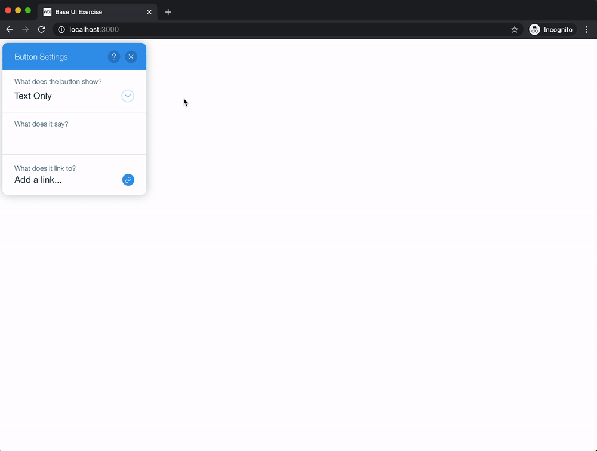
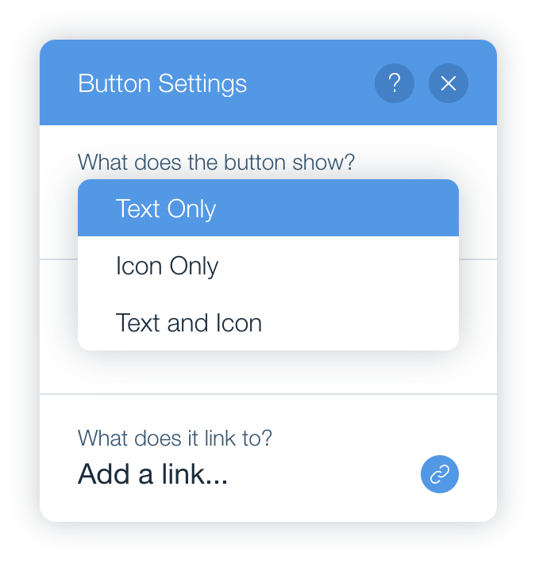

# Base UI Exercise

- [Overview](#overview)
- [Guidelines](#guidelines)
  - [General](#general)
  - [Application Behavior](#application-behavior)
- [How to Start](#how-to-start)

## Overview

The exercise is to implement a panel that appears to be like Button's settings panel in the classic Wix editor:

  

You can go to wix.com, open the editor, and drag a button to your website to see its settings panel in reality.

## Guidelines

### General

- You should use composites (containing controls) from wix-base-ui. **Don't** use controls directly.
- You **don't** need to add additional CSS (all needed styles are already implemented).
- You **don't** need to implement the exact behavior of that settings panel appearing in production - follow the instructions below.
- The media image is placed inside `src/assets` - you can use [Yoshi](https://bo.wix.com/pages/yoshi/docs/styles-and-assets/assets/) to import and pass it as `src`.

### Application Behavior

You should implement the missing view according to the following instructions.

1.

  

## How to Start

1. Clone this project.
2. Run `npm install` which will already install for you wix-base-ui.
3. Run `npm start` and navigate to [localhost:3000](localhost:3000) to see the initial application.

Good luck! 🙃
