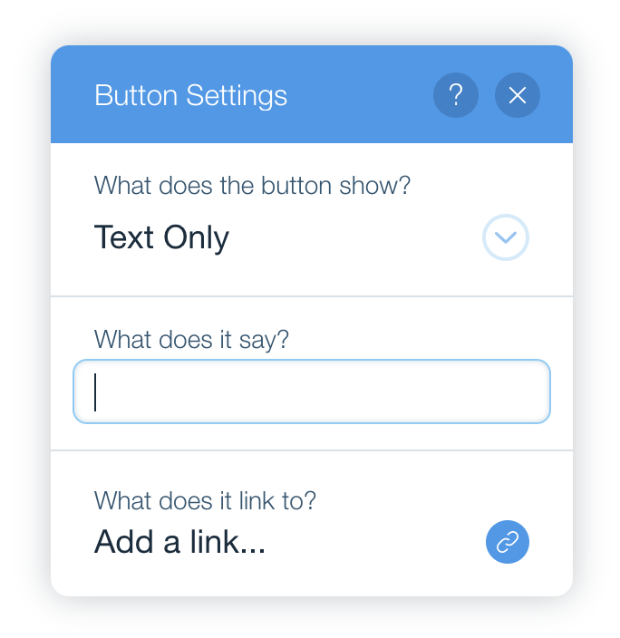
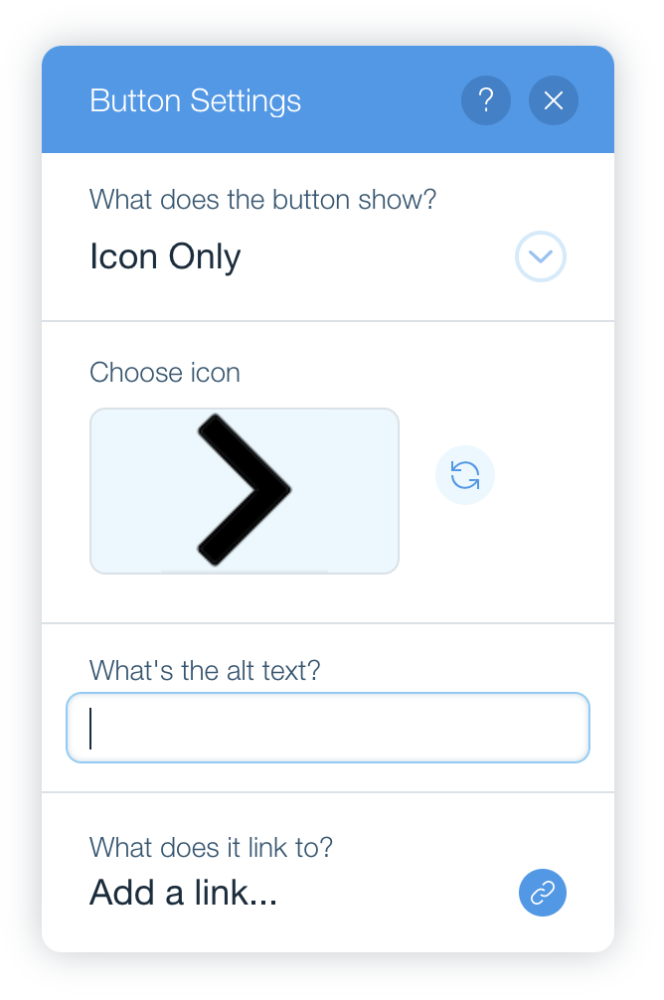
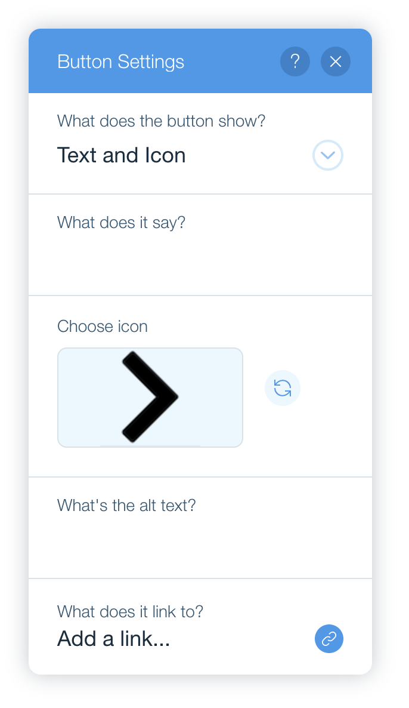

# Base UI Exercise

- [Overview](#overview)
- [Guidelines](#guidelines)
  - [General](#general)
  - [Application Behavior](#application-behavior)
- [How to Start](#how-to-start)

## Overview

The exercise is to implement a panel that appears to be like Button's settings panel in the classic Wix editor:

  

You can go to [wix.com](https://wix.com), open the editor and drag a button to your website to see how its settings panel behaves in reality (keep in mind that there might be visual gaps depending on skin/new changes). Having said that, we're not going to completely implement the real behavior, only focus on visual aspects.

## Guidelines

### General

- You should use composites (containing controls) from wix-base-ui.
- You **shouldn't** use controls directly (except the divider separating the composites).
- You **don't** need to add additional CSS (all needed styles are already implemented).
- You **don't** need to implement the complete behavior of Button's settings panel appearing in Wix Editor (and so don't need to integrate with the Editor API). Focus on visual aspects of the panel following the instructions below.
- You **don't** need to make the buttons inside `PanelHeader` operate. They are only for the panel visual simulation.
- The media image is placed inside `src/assets` - you can use [Yoshi](https://bo.wix.com/pages/yoshi/docs/styles-and-assets/assets/) to import and pass it as `src`.

### Application Behavior

You should implement the missing view according to the following instructions.

1. The panel header is already implemented. You're supposed to implement the content of the panel, which can be changed dynamically by a dropdown:

  

There are three options - "Text Only", "Icon Only" & "Text and Icon". Each state changes the relevant compositions accordingly. Note that both dropdown and link sections are fixed and should appear in all (those three) views.

2. The first view is "Text Only" which should contain an input with a label from above:

  

When the input changes, nothing really should happen in our application. You can log it to the console. The same when adding a link on using its action symbol - log (or alert) it.

3. The second view is "Icon Only" which should contain an image button (in production it's being used to load an icon image from the media manager, but you don't open anything) and an input with label below:

  

Both the media button and its symbol button should be mocked when clicking them - again, logging or alerting are fair enough.

4. The third view is "Text and Icon" which should contain the content of both previous views:

  

Try reusing and not reimplementing them.

## How to Start

1. Clone this project.
2. Run `npm install` which will already install for you wix-base-ui.
3. Run `npm start` and navigate to [localhost:3000](http://localhost:3000) to see the initial application.

Good luck! 🙃
